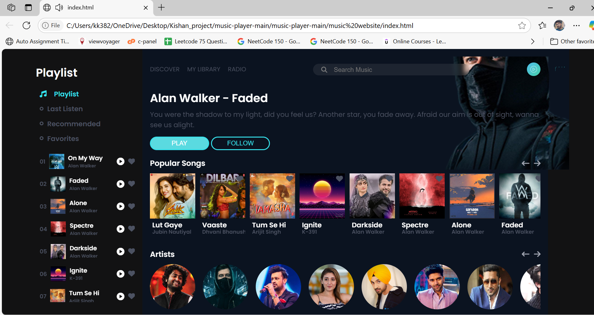

# 🎵 Music Player Web App

A responsive and interactive music player web application built using **HTML**, **CSS**, and **JavaScript**. This project showcases a clean UI and multiple pages like Favorites, Last Listen, My Library, and Recommended tracks — all styled and controlled using vanilla frontend technologies.
---

## 🚀 Features

- 🎧 Custom music player UI with play/pause, next, previous, seek, and volume control
- ❤️ Favorites playlist management
- ⏮️ Last listened songs tracking
- 📚 My Library for personal music collection
- 💡 Recommended songs section
- 🌙 Light/Dark themed visual style
- 🔁 Seamless navigation between views/pages using JavaScript
- 🎨 CSS animations and transitions for rich user experience

---

## 📁 Project Structure
Music-Player/
├── Music Website Img and Audio File_/ # Assets like audio tracks and images
├── bg.png # Background image
├── index.html # Main homepage
├── favorites.html / favorites.js # Favorites section and logic
├── last_listen.html / last_listen.js # Last listened section and logic
├── my_library.html / my_library.js # Library section and logic
├── recommended.html / recommended.js # Recommended section and logic
├── script.js # Shared/player logic
├── control.js # Control logic for UI elements
├── styles.css # Main stylesheet

---
## 💻 How to Run

1. Clone the repository:
   ```bash
   git clone https://github.com/your-username/music-player.git
   cd music-player
🛠️ Technologies Used
HTML5 – Page structure

CSS3 – Styling and animations

JavaScript (ES6) – Interactivity and logic
🙌 Author
Developed by kishan kushavaha

📜 License
This project is open-source and available under the MIT License.